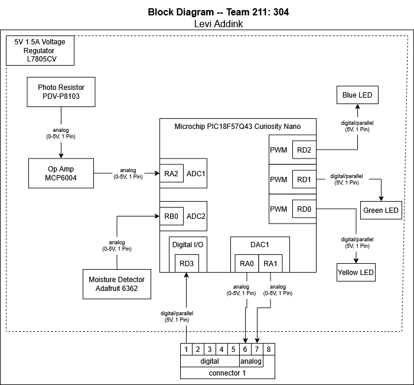

## Overview
The purpose of this block diagram is to highlight the components in my specific portion of the project. Given that our team selected the Hub and Spoke setup, this device will function more as a subsystem. Using a photoresistor to measure sunlight, and a moisture sensor to measure moisture levels, my Curiosity Nano will read this information, and then send it to the Hub board via the 8 pin connector.

This board will also have three LED lights, a green light to indicate that it is functioning properly, and a blue light to indicate measurements being sent back to the Hub board, and a yellow light for debuging.

Since there are no actuators or higher voltage components connected to this board, it can run entirely off of the 5V 1.5A regulated power supply.

## Block Diagram

