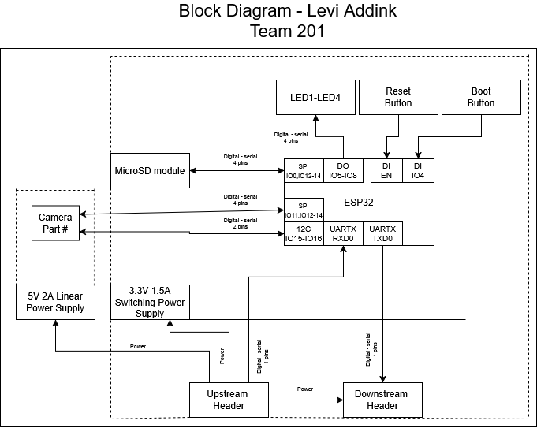

## Overview
Below is the block diagram for my section of team 201's device. It contains a microcontroller, camera, sd card module, and LED's for indication. The board recieves power through either a connector to the other teammembers boards, or a barrel jack, this power is regulated to 3.3V by the switching power supply. Information and power is transmitted between boards in a daisy chain format, the connector has wires for both UART communication and unregulated power.

Arrows indicate direction of the signals, and nearby text indicates the type of signal. Dashed lines indicate power, and solid lines indicate the PCB footprint.

The block diagram is useful for planning the functions of the PCB in a more abstract way before begining the design of the PCB itself.

## Example Block Diagram 

## Explanation
The block diagram was designed with all the project requirements in mind, it includes a sensor, upstream and downstream headers, LEDs, a debug button, and a 3.3V power regulator. These are the main requirments of the project, additionally there is a micro SD slot, which was a personal stretch goal and not required. Designing this block diagram before the electrical schematic allowed it to serve as a guideline for the later designs of the PCB, since it showed what components had to be within the design.
