title: Component Selection Example
---

**5V Linear Regulator**

| **Solution**                                                                                                                                                                                      | **Pros**                                                                                                                                    | **Cons**                                                                                            |
| ------------------------------------------------------------------------------------------------------------------------------------------------------------------------------------------------- | ------------------------------------------------------------------------------------------------------------------------------------------- | --------------------------------------------------------------------------------------------------- |
| 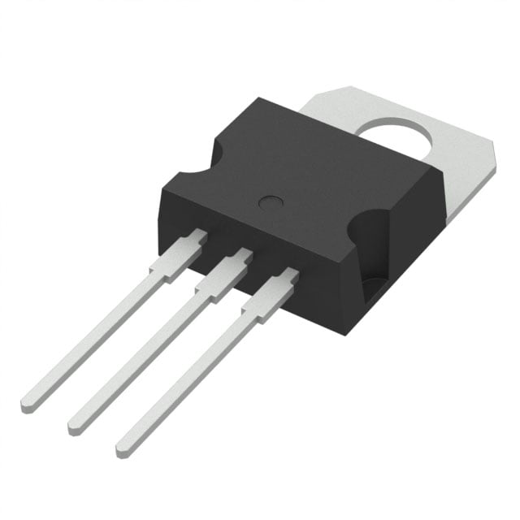 Option 1.  L7805CV Linear Voltage Regulator IC $0.50/each [Link to product](https://www.digikey.com/en/products/detail/stmicroelectronics/L7805CV/585964)| \* Inexpensive \* Straightforward to use \* Already have one on hand, no delivery or purchase needed                                               | \* Requires external components and support circuitry for interface |
| 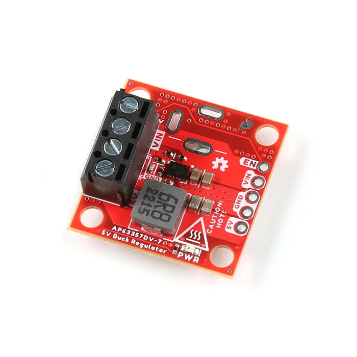 \* Option 2.  \* SparkFun Buck Regulator Breakout - 5V (AP63357)  \* $7.70/each  \* [Link to product](https://www.sparkfun.com/sparkfun-buck-regulator-breakout-5v-ap63357.html) | \* No other components needed  \* more than double the required max current | * On backorder  \* Will require a heatsink at higher currents  \* higher price than the other options                                                         |
| 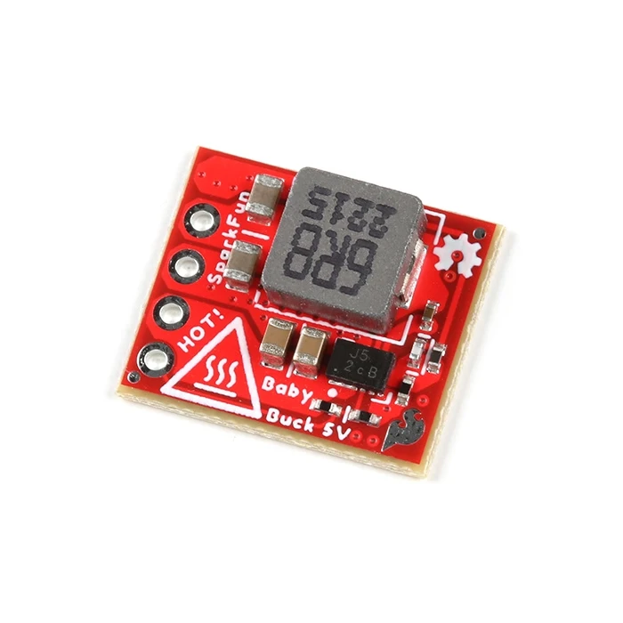 \* Option 3.  \* SparkFun BabyBuck Regulator Breakout - 5V (AP63357)  \* $5.95/each  \* [Link to product](https://www.sparkfun.com/sparkfun-babybuck-regulator-breakout-5v-ap63357.html) | \* No other components needed  \* More than double the required maximum current  \* Very compact | * Risk of overheating  \* Will require an effective heat sink                                                         |

**Choice:** Option 1: L7805CV Linear Voltage Regulator IC

**Rationale:** Option 2 and 3 are good choices, but their price does not justify their convenience. Option 1 is available, and simple enough to use, even if additional components are required for it to work. Additionally this PCB will not draw much current so the higher maximums of options 2 and 3 aren't much of a pro.

**Power Source**

| **Solution**                                                                                                                                                                                      | **Pros**                                                                                                                                    | **Cons**                                                                                            |
| ------------------------------------------------------------------------------------------------------------------------------------------------------------------------------------------------- | ------------------------------------------------------------------------------------------------------------------------------------------- | --------------------------------------------------------------------------------------------------- |
| 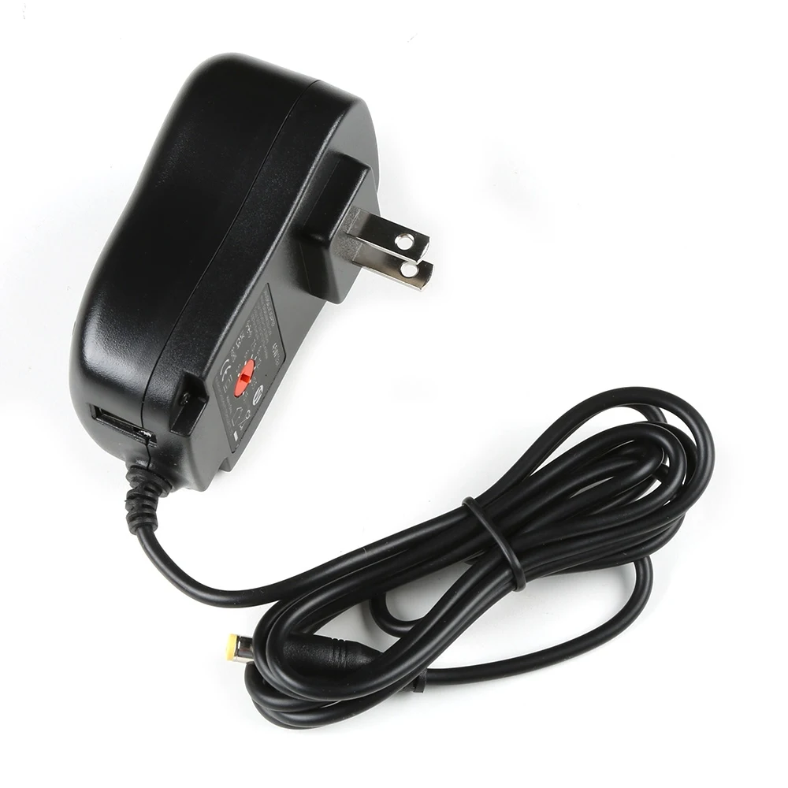 Option 1.  9V wall power supply| \* Inexpensive \* Straightforward to use \* Already have one on hand, no delivery or purchase needed                                               | \* Requires additional components to reduce voltage |
| 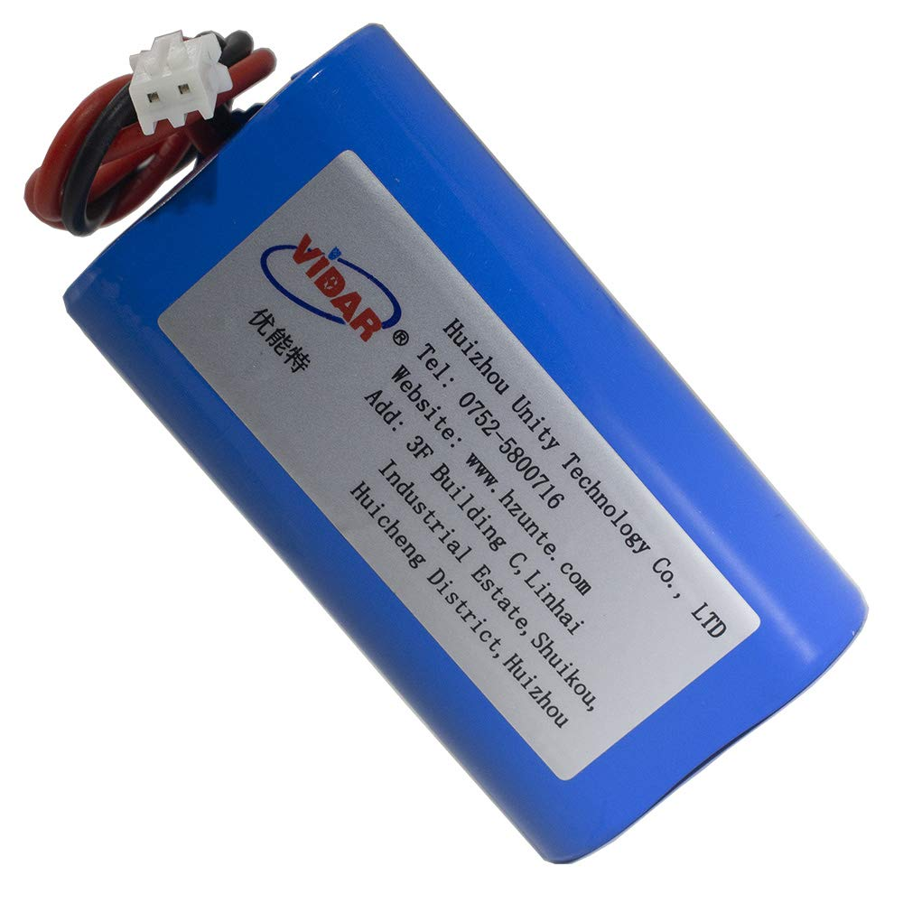 \* Option 2.  \* Rechargeable Li-ion battery| \*Rechargeable  \* Higher current than alkaline batteries | * Requires charger  \* More expensive
| 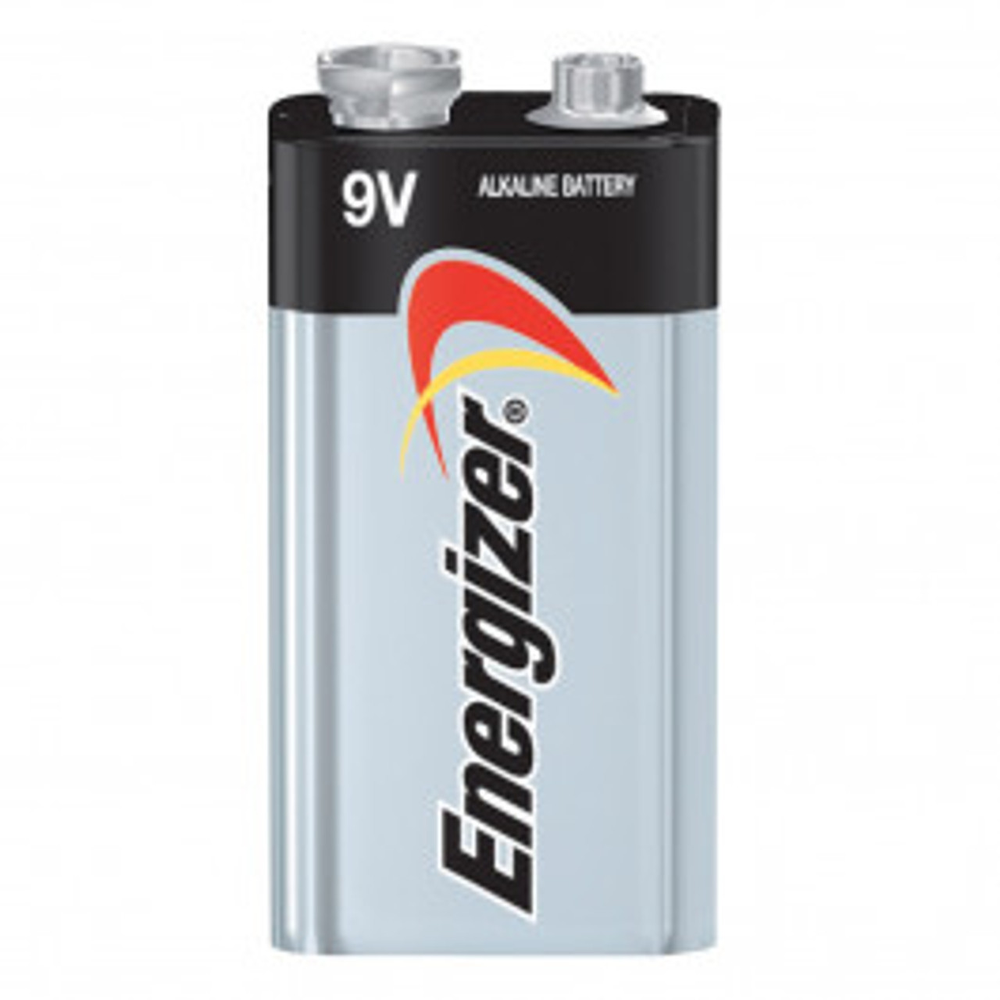 \* Option 3.  \* 9V Battery| \* Can be used outside of a home  \* Can be easily relocated | * Need to replace batteries.  \* Requires additional components to reduce and regulate voltage

**Choice:** Option 1: 9V wall power supply

**Rationale:** A wall adaptor was already provided to us. A battery wouldn't make sense for this device since it is stationary and located within a home. Additionally it would be difficult and needlessly complex to rectify and regulate an unregulated wall power supply on the PCB itself so Option 1 is the ideal choice.

**Light Detector**

| **Solution**                                                                                                                                                                                      | **Pros**                                                                                                                                    | **Cons**                                                                                            |
| ------------------------------------------------------------------------------------------------------------------------------------------------------------------------------------------------- | ------------------------------------------------------------------------------------------------------------------------------------------- | --------------------------------------------------------------------------------------------------- |
| 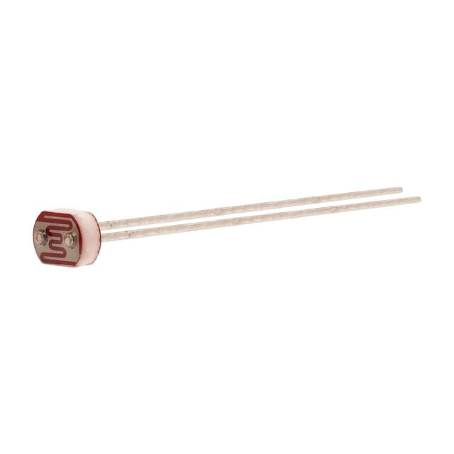 Option 1.  PDV-P8103 Photo-Resistor $0.70/each [Link to product](https://www.digikey.com/en/products/detail/advanced-photonix/PDV-P8103/480610)| \* Inexpensive \* Already have one on hand, no delivery or purchase needed                                               | \* Requires external components and support circuitry for interface  \* May not be very accurate|
| 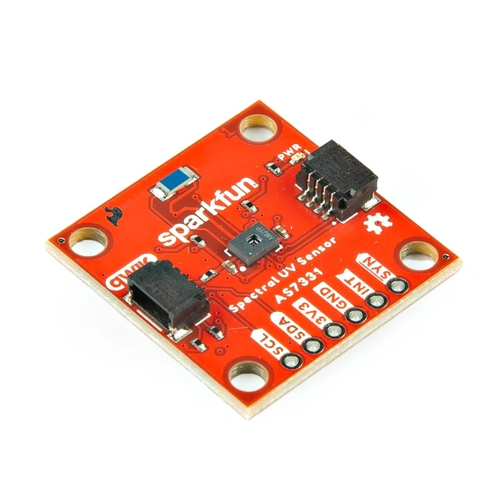 \* Option 2.  \* SparkFun Spectral UV Sensor - AS7331  \* $27.50/each  \* [Link to product](https://www.sparkfun.com/sparkfun-spectral-uv-sensor-as7331-qwiic.html) | \* No other components needed  \* Low current draw   \* Very accurate| * Very expensive  \*  More complicated connections  \* Lots of additional features that are not needed   |
| 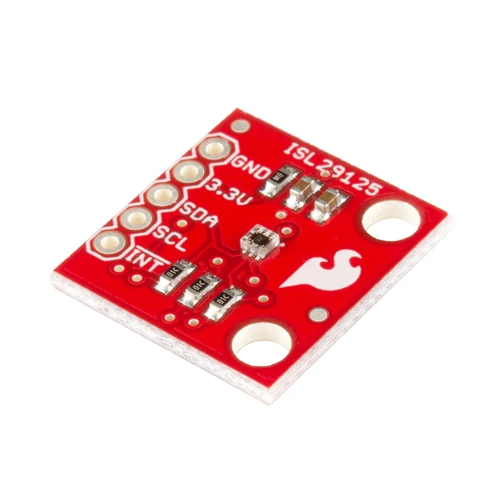 \* Option 3.  \* SparkFun RGB Light Sensor - ISL29125  \* $11.95/each  \* [Link to product](https://www.sparkfun.com/sparkfun-rgb-light-sensor-isl29125.html) | \* No other components needed  \* Very low current draw \* Quick communication with the microcontroller| * Quite expensive  \* 3.3V logical voltage                              |

**Choice:** Option 1: PDV-P8103 Photo-Resistor

**Rationale:** The light detection I require does not need to be precise at all. I simply need any device to detect if there is or is not light. Option 2 and 3 are significantly more expensive than option 1, and much more complicated than they need to be. Option 1 is smaller, cheaper, and gets the job done.

**Moisture Sensor**

| **Solution**                                                                                                                                                                                      | **Pros**                                                                                                                                    | **Cons**                                                                                            |
| ------------------------------------------------------------------------------------------------------------------------------------------------------------------------------------------------- | ------------------------------------------------------------------------------------------------------------------------------------------- | --------------------------------------------------------------------------------------------------- |
| 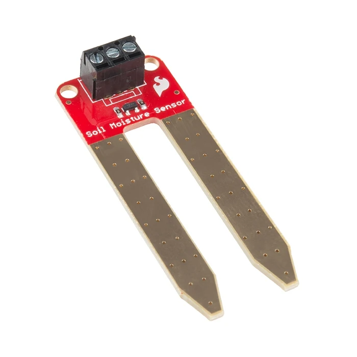 Option 1.  HiLetgo 5pcs LM393 3.3V-5V Soil Moisture Detect Sensor $7.95/each [Link to product](https://www.sparkfun.com/sparkfun-soil-moisture-sensor-with-screw-terminals.html)| \* Straightforward to use \* screw terminals  \* Corrosion resistant                                             | \* May require additional components \* May not be very accurate|
| 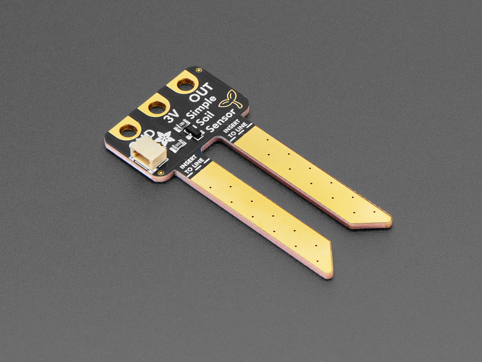 \* Option 2.  \* Adafruit Simple Soil Moisture Sensor  \* $3.00/each  \* [Link to product](https://www.adafruit.com/product/6362) | \* Small and compact  \* Low cost | * May be too small for larger plants  \*  Not a very large range of output values    |
| 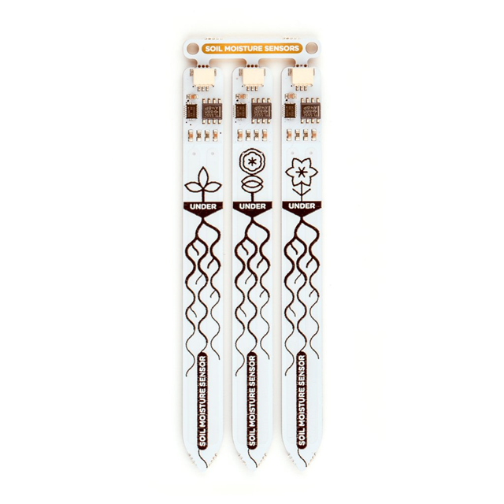 \* Option 3.  \* PIM520  \* $4.6-/each  \* [Link to product](https://www.digikey.com/en/products/detail/pimoroni-ltd/PIM520/13537122) | \* No other components needed  \* Nice visual design \* More accurate capacitive sensor \* long probes for measuring deeper soil| * More expensive  \* Extremely expensive shipping                             |

**Choice:** Option 2: Adafruit Simple Soil Moisture Sensor

**Rationale:** All options are very similar. Option 2 is much cheaper than 1 for essentially the same quality and function, so Option 1 is out. The capacitive sensor was interesting, but ultimately nowhere near worth the higher cost and shipping time. Option 2 is also more compact, and our device is more geared towards smaller potted plants.

It's also worth noting that although the actual device has a 3V indicator on it, the website says that 5V is fine to use as well, which is the voltage I plan to use.

## Summary Table
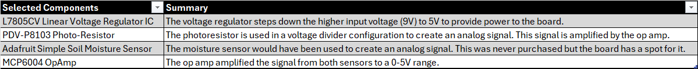
## MCC Configuration (PIC)/ Pinout Table
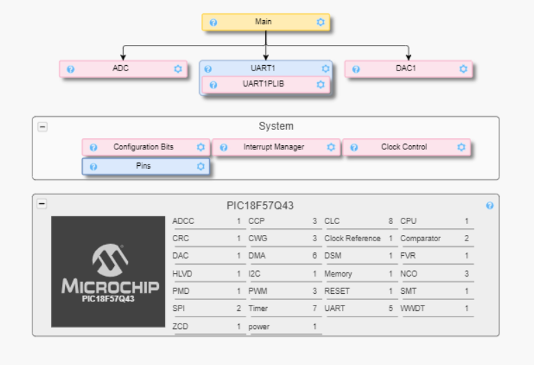
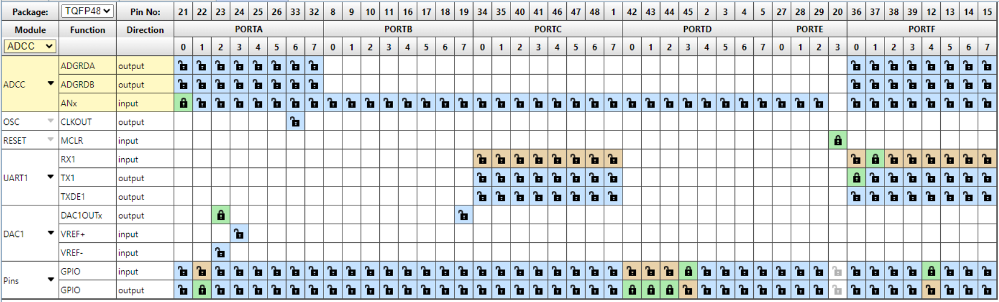
