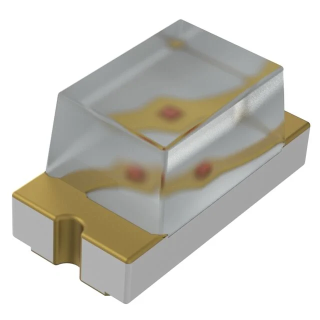

**Camera Module**

1. Arducam 0.3MP

    

    * $6/each
    * [link to product](https://www.arducam.com/640x480-0-3-mp-mega-pixel-lens-ov7675-cmos-camera-module-with-adapter-board.html)

    | Pros                                      | Cons                                                             |
    | ----------------------------------------- | ---------------------------------------------------------------- |
    | Inexpensive device                               | Lots of pins |
    | Low power consumption                      | Low image quality                                       |
    | Fast communication and data exchange                                     |   |

2. Arducam 2MP

    

    * $26/each
    * [link to product](https://www.arducam.com/arducam-2mp-spi-camera-b0067-arduino.html)

    | Pros                                      | Cons                                                             |
    | ----------------------------------------- | ---------------------------------------------------------------- |
    | Higher image quality                               | Decently expensive |
    | Less pins, uses both SPI and I2C                      | Larger storage size for images captured                           |

3. OV7670 camera module

    

    * $6/each
    * [link to product](https://www.digikey.com/en/products/detail/olimex-ltd/CAMERA-OV7670/21662189)

    | Pros                                      | Cons                                                             |
    | ----------------------------------------- | ---------------------------------------------------------------- |
    | Decent image quality                            | Lots of pins |
    | Inexpensive device                      | May require an external oscillator                            |
    | Commonly used, more documentation online | |

**Selection and Rationale**:
For the camera I selected option #2 the Arducam 2MP. Although this is the most expensive of the three options, it should be the most straightforward to use. The Arducam 2MP board has several components to make control and data exchange quicker, and more simple than the alternatives. Despite the steep cost I believe that it is worth it for the simplicity and higher image quality.

**MicroSD card holder:**

There are not several different types of surface mount microSD slots that can be compared, they all do exactly the same thing. The only differences between these devices is style, and maybe slight differences in quality. Because of this I found it was not helpful, or possible to create a comparison between 3 different options in regards to this device.

**Product Name:** MSD-4-A
**Price:** $0.36/each
**Link:** [Link to product](https://www.digikey.com/en/products/detail/same-sky-formerly-cui-devices/MSD-4-A/21796808)

**Voltage regulator**

1. IC REG BUCK 3.3V 2A TSOT23-6

    

    * $0.71/each
    * [link to product](https://www.digikey.com/en/products/detail/diodes-incorporated/AP63203WU-7/9858426)

    | Pros                                      | Cons                                                             |
    | ----------------------------------------- | ---------------------------------------------------------------- |
    | Inexpensive device | Simple and may lack features other similar devices have |
    | High maximum current | May have poorer performance than other similar devices |

2. 	IC REG BUCK 3.3V 2A 6VSON

    

    * $2.03/each
    * [link to product](https://www.digikey.com/en/products/detail/texas-instruments/TPS6282533DMQR/15212775)

    | Pros                                      | Cons                                                             |
    | ----------------------------------------- | ---------------------------------------------------------------- |
    | Smaller footprint | Lower input voltage range |
    | High maximum current | May be inconvient to solder |

3. 	IC REG BUCK 3.3V 800MA 10VSSOP

    

    * $1.25/each
    * [link to product](https://www.digikey.com/en/products/detail/texas-instruments/TPS62056DGSR/1672287)

    | Pros                                      | Cons                                                             |
    | ----------------------------------------- | ---------------------------------------------------------------- |
    | Higher efficiency | More pins |
    | Adjustable output voltage | More expensive than other options |
    | | Low maximum current |

**Selection and Rationale**:
I selected option #1 "IC REG BUCK 3.3V 2A TSOT23-6", it is the most simple, inexpensive and straightforward of the three options. The 2A limit is likely more than enough for my board, and the large input voltage range is plenty for the input power. Overall there's no reason to overcomplicate this component, the first option works.

   **LED**

1. LED BLUE CLEAR SMD

    

    * $0.13/each
    * [link to product](https://www.digikey.com/en/products/detail/liteon/LTST-C194TBKT/2356225)

    | Pros                                      | Cons                                                             |
    | ----------------------------------------- | ---------------------------------------------------------------- |
    | Cheap device | Higher current draw |
    | Higher input voltage, no resistors required | Not diffused |

3. 	LED RED DIFFUSED 0603 SMD

    

    * $0.14/each
    * [link to product](https://www.digikey.com/en/products/detail/ams-osram-usa-inc/LS-Q976-NR-1-0-20-R18/1227986)

    | Pros                                      | Cons                                                             |
    | ----------------------------------------- | ---------------------------------------------------------------- |
    | LED is diffused | Very small, may be difficult to solder |
    | Lower current draw | Will require a resistor |

5. LED RED DIFFUSED 1608 SMD

    

    * $0.12/each
    * [link to product](https://www.digikey.com/en/products/detail/rohm-semiconductor/SML-D12U1WT86/5843853)

    | Pros                                      | Cons                                                             |
    | ----------------------------------------- | ---------------------------------------------------------------- |
    | LED is diffused | Small, may be difficult to solder |
    | Lower current draw | Will require a resistor |

**Selection and Rationale**:
I selected option #3, "LED RED DIFFUSED 1608 SMD". Mainly I just wanted the diffisued LEDs for the astetic, and i like the color red. On the more practical side, the LED used doesn't matter too much, and these LEDs will work just fine, the additional requirment of a resistor isn't too much added difficulty, and although the LED is small I believe I will be able to solder it.

## Microcontroller Selection

| ESP Info                                      | Answer | Help                                                                                                      |
| --------------------------------------------- | ------ | --------------------------------------------------------------------------------------------------------- |
| Model                                         | ESP32-S3      | Include the entire part number (leave off any letters at the end that specify the package type)           |
| Product Page URL                              | [link](https://www.espressif.com/en/products/socs/esp32-s3)      | Found on Espressif.com                                                                                    |
| ESP32-S3-WROOM-1-N4 Datasheet URL             | [link](https://documentation.espressif.com/esp32-s3-wroom-1_wroom-1u_datasheet_en.pdf) | Do not paste links directly into the table.  Use a [link](#) |
| ESP32 S3 Datasheet URL                        | [link](https://documentation.espressif.com/esp32-s3_datasheet_en.pdf) | Has more detail on functions |
| ESP32 S3 Technical Reference Manual URL       | [link](https://documentation.espressif.com/esp32-s3_technical_reference_manual_en.pdf)      | Has details on I/O multiplexing, USB, and others                                                          |
| Vendor link                                   | [link](https://www.digikey.com/en/products/detail/espressif-systems/ESP32-S3-WROOM-1-N4/16162639)      | Digikey, Jameco, etc.  Do not paste links directly into the table.  Use a [link](#)|
| Code Examples                                 | [SPI](https://github.com/espressif/arduino-esp32/blob/master/libraries/SPI/src/SPI.h) [i2C](https://docs.espressif.com/projects/arduino-esp32/en/latest/api/i2c.html) [Arducam Tutorial](https://www.youtube.com/watch?v=hybQpjwJ4aA) | url(s) for libraries on github or other sites related to the microcontroller and your planned peripherals |
| External Resources URL(s)                     | [Esp32Tutorial](https://randomnerdtutorials.com/getting-started-with-esp32/) [Esp32Tutorial](https://esp32io.com/) | Search on Google and YouTube for other resources for each specific microcontroller.|
| Unit cost                                     | $5.06 | Find on Digikey, Jameco, MPJA, or octopart|
| Absolute Maximum Current for entire IC        | 355mA | Find in the microcontroller datasheet|
| Supply Voltage Range                          | 3.0V, 3.3V, and 3.6V respectivly | Min / Nominal / Max / Absolute Max, as found in datasheet|
| Absolute Maximum current   (for entire IC) | 355mA | as found in datasheet|
| Maximum GPIO current   (per pin)           | 40mA | as found in datasheet|
| Supports External Interrupts?                 | Yes | as found in datasheet|
| Required Programming Hardware, Cost, URL      | The ESP32 can be programmed with the MPLAB SNAP debugger, which costs $11.21 | as found in datasheet|

| Module         | # Available | Needed | Associated Pins (or * for any) |
| -------------- | ----------- | ------ | ------------------------------ |
| UART           | 3           | 1      | * (any except GND, 3V3, EPAD and EN pins)|
| external SPI\* | 4           | 1-2      | GPIO26 ~ GPIO32, GPIO9 ~ GPIO14, GPIO33 ~ GPIO37, GPIO8 ~ GPIO14, GPIO33 ~ GPIO39 and * (any except GND, 3V3, EPAD and EN pins, for SPI3) |
| I2C            | 2           | 1      | * (any except GND, 3V3, EPAD and EN pins)|
| GPIO           | 36           | 2      | * (any except GND, 3V3, EPAD and EN pins) |
| ADC            | 20           | 0      | IO1, IO2, IO3, IO4, IO5, IO6, IO7, IO8, IO9, IO10, IO11, IO12. IO13, IO14, IO15, IO16, IO17, IO18, IO19, IO20|
| LED PWM        | 8           | 0-2      | * (any except GND, 3V3, EPAD and EN pins)                              |
| Motor PWM      | 2           | 0      | * (any except GND, 3V3, EPAD and EN pins)                              |
| USB Programmer | 0           | 0      | ESP32 will be programmed with MPLAB SNAP |

**Requirements:**
For my board to function the microcontroller must have at least one SPI subsystem, one UART, and 1 i2C subsystem. It will also need 2 GPIO pins. This comes to a total of 10 pins, 2 i2C pins, 3 SPI pins, 1 clock pin, 1 power pin, 1 ground pin, and 2 GPIO pins.

**Description of role:**
The board I am tasked with creating will have abilitiy to take pictures with a camera, and then store that data, either on the ESP32 or an external microSD card. Storing data to the microSD card is a stretch goal, along with the possibility of storing video data.

**Pinout Diagram:**

**Pin assignments:**

| **Peripheral** | **Pins** |
| -------------- | ----------- |
| LED1 | GPIO4, GND |
| LED2 | GPIO5, GND |
| Camera | IO10-IO14, IO21, GND |
| MicroSD | IO10-IO13, GND |
| UART | IO36,IO37 |

**Microcontroller selection:**
I have selected the ESP32 mainly because it is faster, and has more memory than the PIC. Saving image data will likely take a large chunk of the microcontrollers memory, and reading and moving that data will be helped by the ESP32's increased speed. Although the two options would likely both work, the increased storage size itself is enough of a reason to choose the ESP32.
