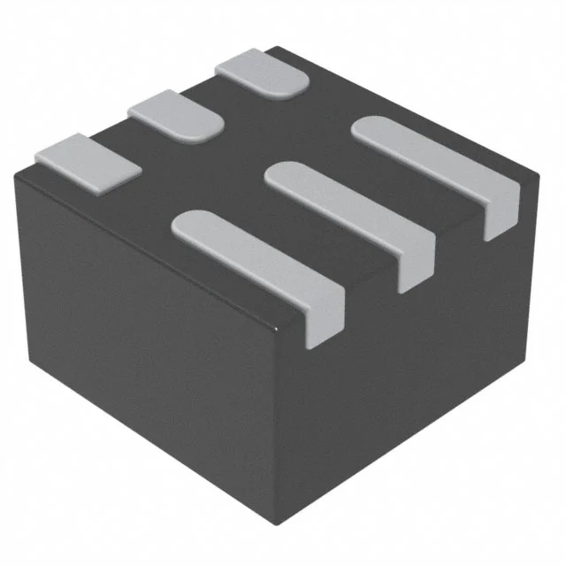

## Module's Selected Major Components

The following sections are the selected major components necessary for  .....

>**For each of the following sections, use <ins>one of the two styles</ins> given near the end. *REMOVE THIS NOTE***

### Power Management

(**remove this note/placeholder**: this is where your 3.3 volt switching regulator, any other needed power regulator, and power source {if applicable} **THAT WERE SELECTED**)

For more details, review the ["Appendix - Component Selection Process - Power Mangement"](https://embedded-systems-design.github.io/EGR314DataSheetTemplate/Appendix/01-Componet-Selection/Component-Selection-Process/#power-management) selection.

### Sensor

(**remove this note/placeholder**: if applicable, this is where your  **SELECTED** sensor is shown. Otherwise, remove this section.)

For more details, review the ["Appendix - Component Selection Process - Sensor"](https://embedded-systems-design.github.io/EGR314DataSheetTemplate/Appendix/01-Componet-Selection/Component-Selection-Process/#sensor) selection.

### Actuator

(**remove this note/placeholder**: if applicable, this is where your **Selected** the actuator items go, which includes both the driver and motor. Otherwise, remove this section.)

For more details, review the ["Appendix - Component Selection Process - Actuator"](https://embedded-systems-design.github.io/EGR314DataSheetTemplate/Appendix/01-Componet-Selection/Component-Selection-Process/#actuator) selection.

-----------
> Remove the following before submitting! Use them to present the selected components

### Style 1

> This is the example found in the assignment, uses more html

*Table 1: Example component selection*

**External Clock Module**

| **Component**                                                                                                                                                                                      | **Pros**                                                                                                                                    | **Cons**                                                                                            |
| ------------------------------------------------------------------------------------------------------------------------------------------------------------------------------------------------- | ------------------------------------------------------------------------------------------------------------------------------------------- | --------------------------------------------------------------------------------------------------- |
|   XC1259TR-ND surface mount crystal $1/each [link to product](http://www.digikey.com/product-detail/en/ECS-40.3-S-5PX-TR/XC1259TR-ND/827366)                 | \* Inexpensive[^1] \* Compatible with PSoC \* Meets surface mount constraint of project                                               | \* Requires external components and support circuitry for interface \* Needs special PCB layout. |

**Rationale:** A clock oscillator is easier ....

### Style 2

> Also acceptable, more markdown friendly

**External Clock Module**

1. XC1259TR-ND surface mount crystal

    

    * $1/each
    * [link to product](http://www.digikey.com/product-detail/en/ECS-40.3-S-5PX-TR/XC1259TR-ND/827366)

    | Pros                                      | Cons                                                             |
    | ----------------------------------------- | ---------------------------------------------------------------- |
    | Inexpensive                               | Requires external components and support circuitry for interface |
    | Compatible with PSoC                      | Needs special PCB layout.                                        |
    | Meets surface mount constraint of project |

**Rationale:** A clock oscillator is easier ...

**Camera Module**

1. Arducam 0.3MP

    

    * $6/each
    * [link to product](https://www.arducam.com/640x480-0-3-mp-mega-pixel-lens-ov7675-cmos-camera-module-with-adapter-board.html)

    | Pros                                      | Cons                                                             |
    | ----------------------------------------- | ---------------------------------------------------------------- |
    | Inexpensive device                               | Lots of pins |
    | Low power consumption                      | Low image quality                                       |
    | Fast communication and data exchange                                     |   |

2. Arducam 2MP

    

    * $26/each
    * [link to product](https://www.arducam.com/arducam-2mp-spi-camera-b0067-arduino.html)

    | Pros                                      | Cons                                                             |
    | ----------------------------------------- | ---------------------------------------------------------------- |
    | Higher image quality                               | Decently expensive |
    | Less pins, uses both SPI and I2C                      | Larger storage size for images captured                           |

3. OV7670 camera module

    

    * $6/each
    * [link to product](https://www.digikey.com/en/products/detail/olimex-ltd/CAMERA-OV7670/21662189)

    | Pros                                      | Cons                                                             |
    | ----------------------------------------- | ---------------------------------------------------------------- |
    | Decent image quality                            | Lots of pins |
    | Inexpensive device                      | May require an external oscillator                            |
    | Commonly used, more documentation online | |

   **Selection and Rationale**:
For the camera I selected option #2 the Arducam 2MP. Although this is the most expensive of the three options, it should be the most straightforward to use. The Arducam 2MP board has several components to make control and data exchange quicker, and more simple than the alternatives. Despite the steep cost I believe that it is worth it for the simplicity and higher image quality.

**MicroSD card holder:**

There are not several different types of surface mount microSD slots that can be compared, they all do exactly the same thing. THe only differences between these devices is style, and maybe slight differences in quality. Because of this I found it was not helpful, or possible to create a comparison between different options in regards to this device.

**Product Name:** MSD-4-A
**Price:** $0.36/each
**Link:** [Link to product](https://www.digikey.com/en/products/detail/same-sky-formerly-cui-devices/MSD-4-A/21796808)

**Voltage regulator**

1. IC REG BUCK 3.3V 2A TSOT23-6

    

    * $0.71/each
    * [link to product](https://www.digikey.com/en/products/detail/diodes-incorporated/AP63203WU-7/9858426)

    | Pros                                      | Cons                                                             |
    | ----------------------------------------- | ---------------------------------------------------------------- |
    | Inexpensive device | Simple and may lack features other similar devices have |
    | High maximum current | May have poorer performance than other similar devices |

2. 	IC REG BUCK 3.3V 2A 6VSON

    

    * $2.03/each
    * [link to product]()

    | Pros                                      | Cons                                                             |
    | ----------------------------------------- | ---------------------------------------------------------------- |
    | Smaller footprint | Lower input voltage range |
    | High maximum current | May be inconvient to solder |

3. 	IC REG BUCK 3.3V 800MA 10VSSOP

    

    * $1.25/each
    * [link to product]()

    | Pros                                      | Cons                                                             |
    | ----------------------------------------- | ---------------------------------------------------------------- |
    | Higher efficiency | More pins |
    | Adjustable output voltage | More expensive than other options |
    | | Low maximum current |

## Microcontroller Selection

**Requirements:**
For my board to function the microcontroller must have at least one SPI subsystem, one UART, and 2 i2C subsystems. It will also need 2 GPIO pins. This comes to a total of 10 pins, 2 i2C pins, 3 SPI pins, 1 clock pin, 1 power pin, 1 ground pin, and 2 GPIO pins.

