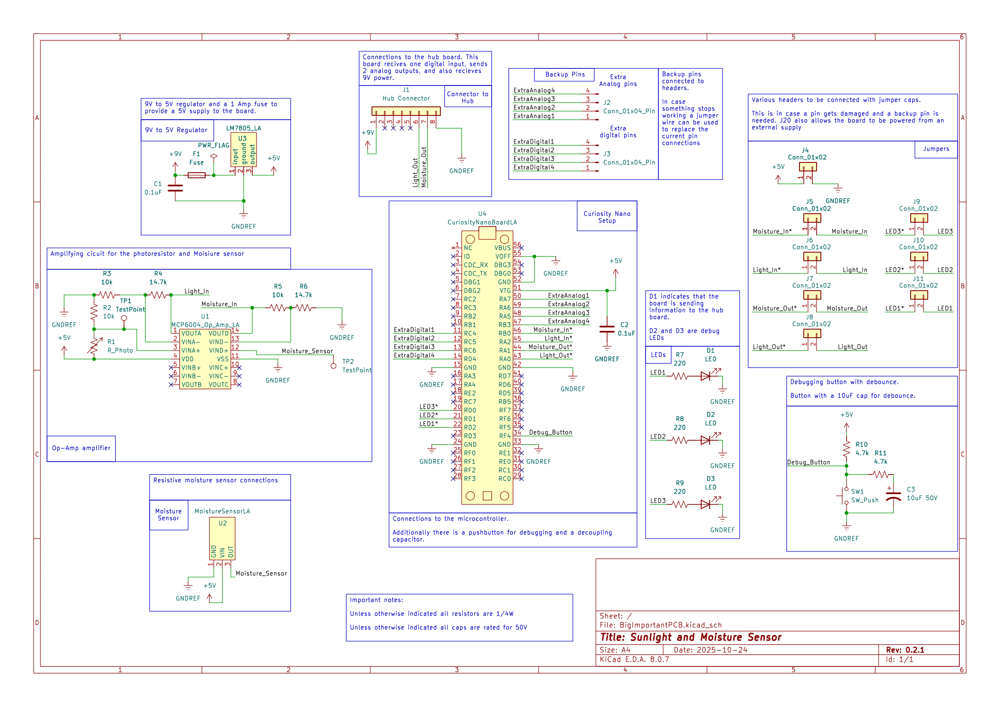

## Overview

This schematic is designed to monitor both sunlight and water levels. It will gather this data and send it through the connector to the Hub board.

**Figure 1:** Individual PCB Schematic

## Resouces
The schematic as a PDF download is available [*here*](PCB.pdf), and the Zip folder of the project [*here*](PCB.zip) and the custom symbols are [*here*](PCBSYM.zip)
