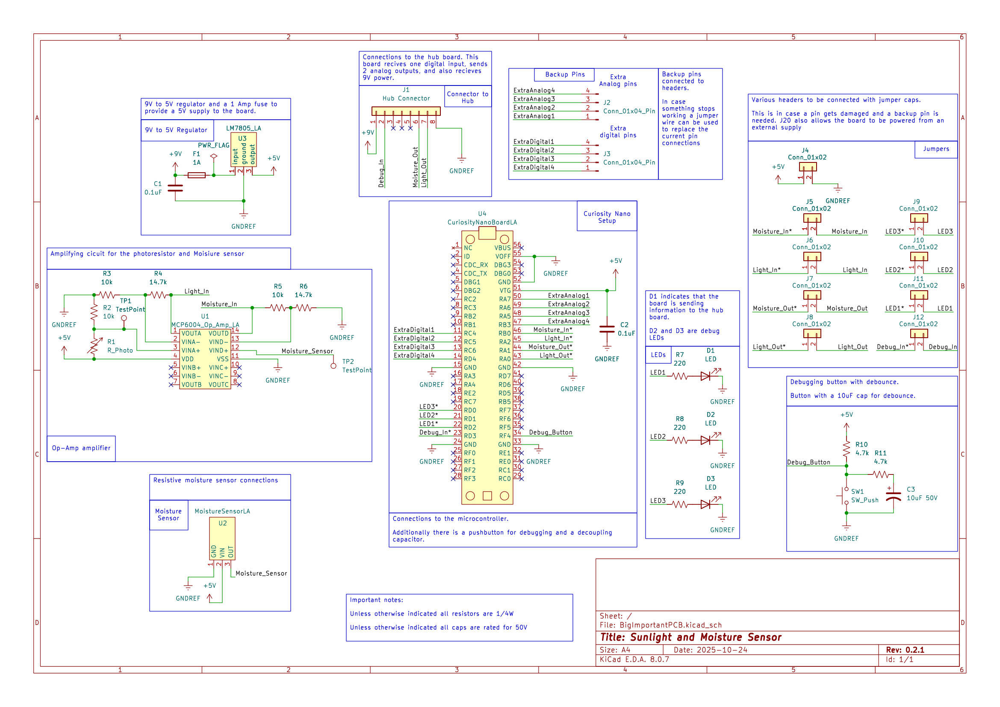

## Overview

This schematic is designed to monitor both sunlight and water levels. It has a photoresistor, and moisture sensor, and both of their signals are amplified via the opamp before being read by the microcontroller. Those values are then mapped to a 0-100% scale, and sent to the main hub board via the 8 pin connector.

The schematic also contains several LEDs and a button for debugging, as well as several spare pins, headers, and a handful of test points in case anything needs debugging.

**Figure 1:** Moisture and Sunlight sensor PCB Schematic

## Resouces
The schematic as a PDF download is available [*here*](SchematicV2.pdf), and the Zip folder of the project [*here*](SchematicV2.zip) and the custom symbols are [*here*](PCBSYM.zip)
