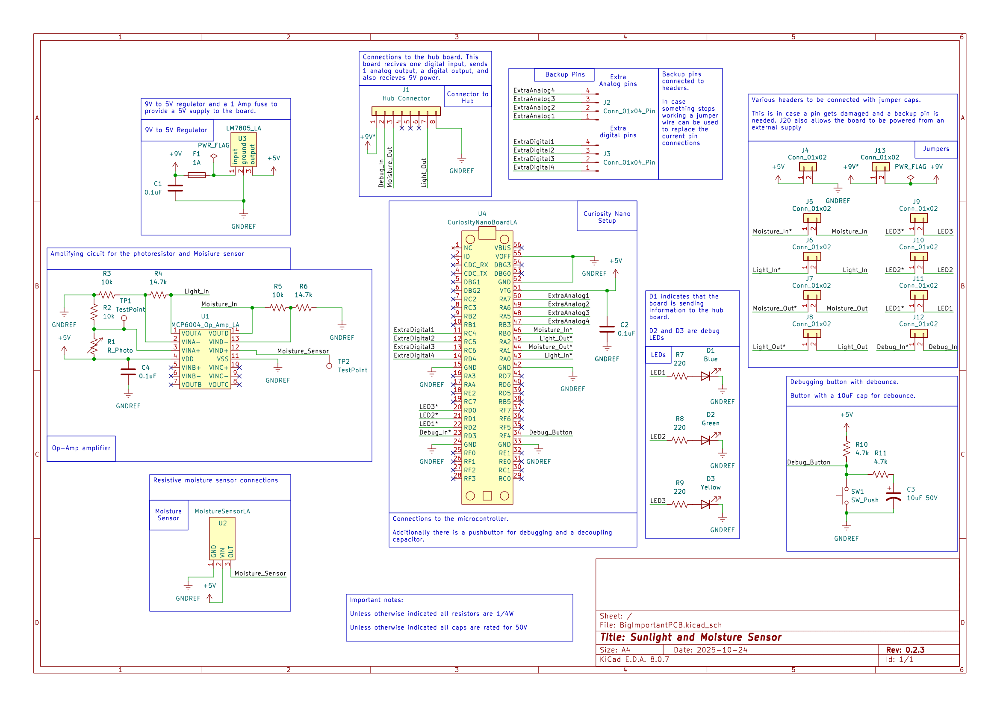

## Overview

This schematic is designed to monitor both sunlight and water levels. It has a photoresistor, and moisture sensor, and both of their signals are amplified via the opamp before being read by the microcontroller. The sunlight values are sent the board as an analog signal, and the moisture sensor values are converted to a digital signal to tell the main board wether the water should be turned on or shut off.

The schematic also contains several LEDs and a button for debugging, as well as several spare pins, headers, and a handful of test points in case anything needs debugging.

**Figure 1:** Moisture and Sunlight sensor PCB Schematic

## Resouces
The schematic as a PDF download is available [*here*](BigImportantPCB.pdf), and the Zip folder of the project [*here*](LA_ProjectFiles.zip) and the custom symbols are [*here*](CustomSymbols.zip) and the custom footprints are [*here*](CustomFootprints.zip)
