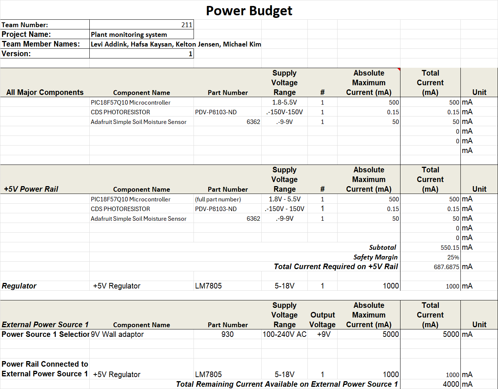

title: Power Budget
---

## Overview
The power budget was created to ensure that the PCB design has adequate amounts of power. This is done by totalling up each of the components current draw and comparing it to the maximum current output from the voltage regulator. Then the voltage regulators current draw is comparred to the power supplys max current. If the math works out, your power supply should be able to deliver enough current, and the regulator should be able to regulate enough current with an additional margin of 25%

[Link to xlsx](LeviPowerBudget.xlsx)

## Conclusions

From the prepare Power Budget, it was determined that the selected regulator does indeed have enough output to easily power all the components on the PCB. The current required is very low.
