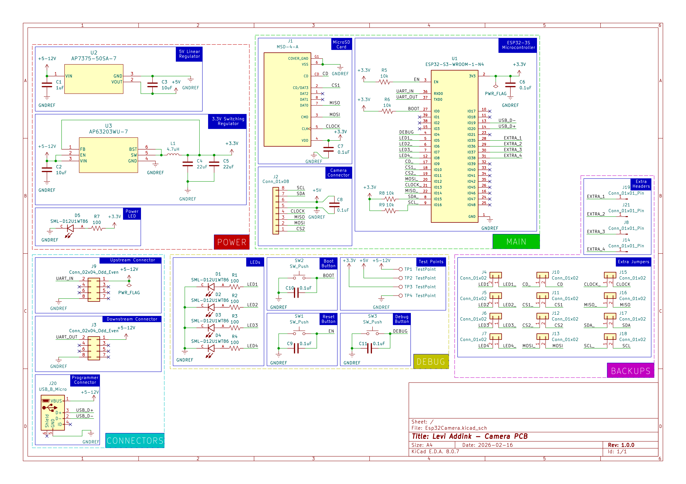

## Overview

This schematic is designed to control a camera daughterboard, and save images to a microSD card. It also has additional hardware such as debug buttons and LEDs as well as extra headers and jumpers for debugging.

**Figure 1:** Schematic.

## Resouces

The schematic as a PDF download is available [*here*](LeviPCB.pdf), and the Zip folder of the project [*here*](LeviPCB.zip).
