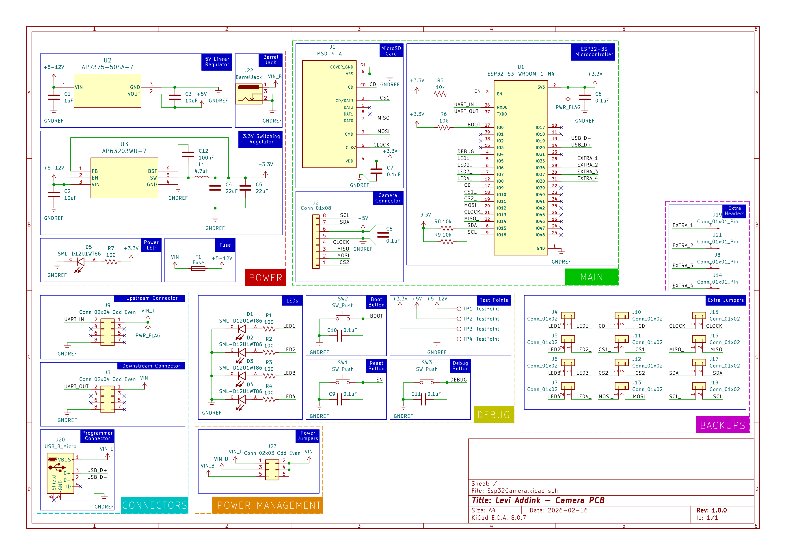
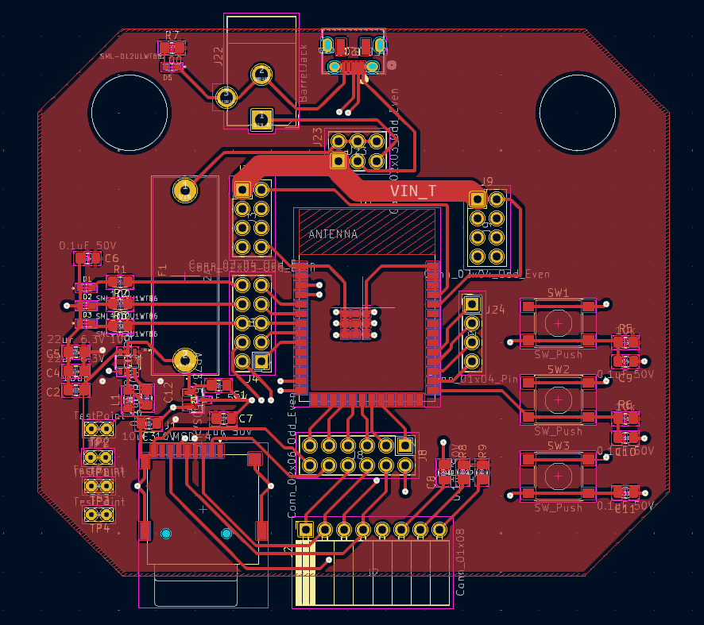
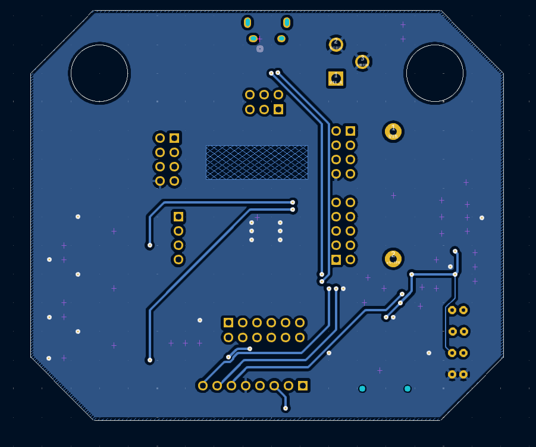

## Overview

This schematic is designed to control a camera daughterboard, and save images to a microSD card. It also has additional hardware such as debug buttons and LEDs as well as extra headers and jumpers for debugging.

## ECAD pictures

**Figure 1:** Schematic.

**Figure 2:** PCB Front

**Figure 3:** PCB Back

## PCB pictures

**Figure 4:** PCB top.

**Figure 5:** PCB bottom.

**Figure 6:** PCB top with components.

**Figure 7:** PCB bottom with components.

## Resouces

The schematic as a PDF download is available [*here*](Esp32Camera2.pdf), and the Zip folder of the project [*here*](Esp32Camera2.zip).
