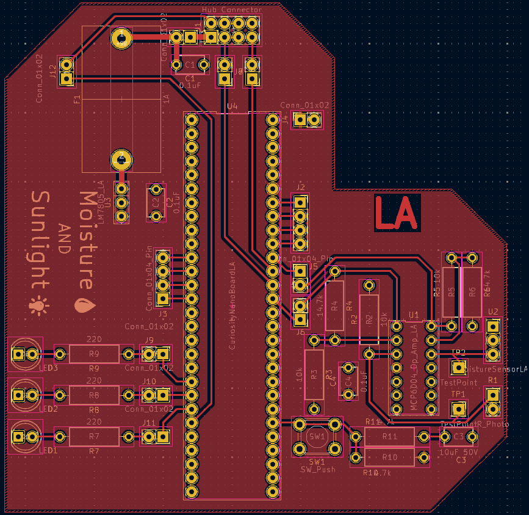
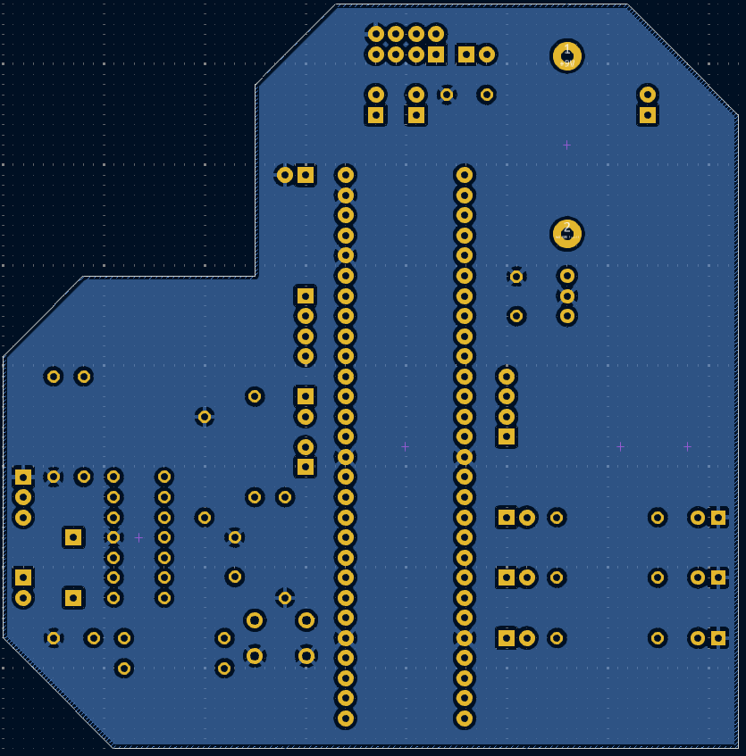

title: PCB Design
---

## Overview
This PCB design contains all the components from the schematic design. The photoresistor and moisture sensor's footprints are both female headers, this is so that the sensors can be connected by a longer wire, and can be swapped out easily. Additionally the microcontroller footprint will also have female headers.
## PCB Images
**Raw PCB**

---

## ECAD Images

[PDF](PCB.pdf)
[Custom footprints](CustomFootprints.zip)
[Gerber files](Levi.zip)
